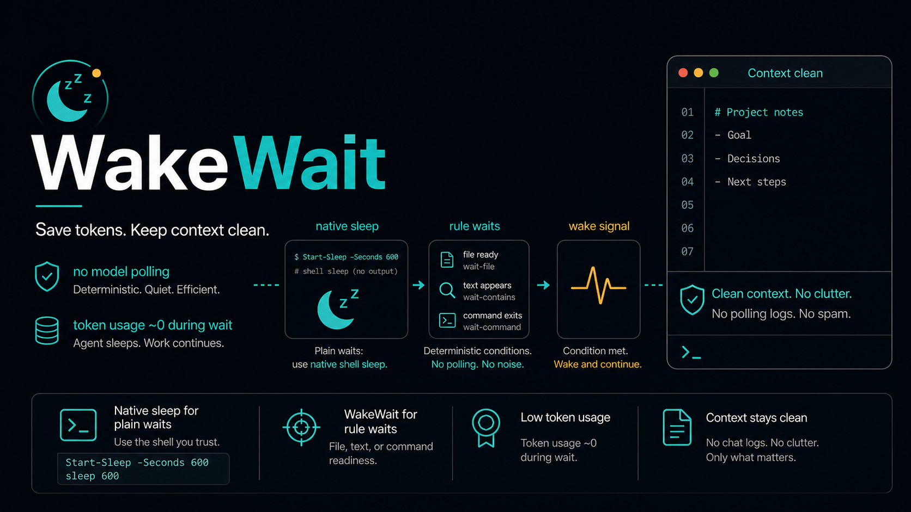

<p align="center">
  
</p>

# WakeWait

Independent auto sleep and long waits for agent CLIs.

WakeWait lets Codex or another agent stop spending model time while training jobs, downloads, evaluations, queues, or remote tasks are still running. It sleeps locally, polls simple deterministic rules, persists wait state, and avoids calling the model during the wait loop.

`v1` is a standalone CLI. Pi slash-command support is optional and can be patched later with `wakewait patch`.

## One-Click Install

Give Codex this prompt:

```text
Install the latest WakeWait from https://github.com/yptang98/WakeWait.

Use the README, install Node.js 20+ if needed, run the correct installer for my OS, verify `wakewait status` and `npm run check`, then show me one `wakewait sleep` example and one `wakewait wait-for` example.
```

Codex can clone the repo, run the installer, install the WakeWait skills, verify the CLI, and report the commands you can use.

## Manual One-Line Install

Use these only if you do not want Codex to run the install.

Windows PowerShell:

```powershell
irm https://raw.githubusercontent.com/yptang98/WakeWait/main/scripts/install.ps1 | iex
```

macOS / Linux:

```bash
curl -fsSL https://raw.githubusercontent.com/yptang98/WakeWait/main/scripts/install.sh | sh
```

The installer:

- installs helper files under `~/.wakewait`
- creates `wakewait` and `pi-wait-patch` launchers under `~/.wakewait/bin`
- installs `auto-sleep` and `deferred-wait` into `~/.codex/skills`
- optionally patches detected Pi coding-agent runtimes with `/sleep` and `/wait-for`
- creates backups so uninstall can restore patched runtime files

If `wakewait` is not found in a new shell, add `~/.wakewait/bin` to `PATH`, or call the script directly with `node ~/.wakewait/scripts/wakewait.mjs`.

## Usage

Check persisted waits:

```bash
wakewait status
```

Sleep for a fixed time:

For a short foreground wait, just use the native shell. This is the most comfortable auto-sleep path.

Windows PowerShell:

```powershell
Start-Sleep -Seconds 60; Get-Date -Format o
```

macOS / Linux:

```bash
sleep 60; date -Iseconds
```

Use WakeWait when you need background recovery or persisted state:

```bash
wakewait sleep 30m --background --on-ready "codex \"check logs/train.log and summarize progress\""
```

Wait for a file:

```bash
wakewait wait-for --file outputs/done.json --every 5m --timeout 6h --background --on-ready "codex \"read outputs/done.json and summarize metrics\""
```

Wait for a log rule:

```bash
wakewait wait-for --contains logs/train.log "Evaluation complete" --every 5m --timeout 6h --background
```

Run fixed health rules while waiting:

```bash
wakewait wait-for --file outputs/done.json --every 5m --timeout 6h --background --health-log logs/train.log
```

Cancel one wait or all waits:

```bash
wakewait cancel <id>
wakewait cancel all
```

Useful flags:

| Flag | Purpose |
| --- | --- |
| `--background` | Optional background worker that continues after the CLI command exits |
| `--on-ready "<command>"` | Optional command to run after sleep wakes, a condition succeeds, or a timeout occurs |
| `--file <path>` | Succeed when a file exists |
| `--contains <path> <text>` | Succeed when a file contains fixed text |
| `--condition "<command>"` | Succeed when a shell command exits 0 |
| `--health-log <path>` | Periodically scan a log with fixed built-in failure rules such as OOM, traceback, NaN/Inf loss, killed process |
| `--health-every 30m` | Frequency for fixed health-rule scans when `--health-log` is set |
| `--state <path>` | Store or inspect wait state somewhere other than `.codex-wait/tasks.json` |

## Optional Slash Commands

WakeWait works without host patching. If you use a Pi-compatible runtime and want `/sleep` and `/wait-for` slash commands, run:

```bash
wakewait patch --root <pi-coding-agent-or-node_modules-path>
```

The patch is optional. It only modifies detected Pi runtime files and writes backups into `~/.wakewait/backups` for uninstall.

## Uninstall With Codex

Give Codex this prompt:

```text
Uninstall WakeWait from my local Codex setup.

Use the WakeWait uninstall script from ~/.wakewait, remove installed WakeWait skills, restore backed-up optional runtime files, verify `wakewait` is gone or explain if PATH still points at it, and keep state only if I ask.
```

## Manual Uninstall

Windows PowerShell:

```powershell
& "$HOME\.wakewait\scripts\uninstall.ps1"
```

macOS / Linux:

```bash
sh "$HOME/.wakewait/scripts/uninstall.sh"
```

Add `--keep-state` if you want to preserve `~/.wakewait`.

## Plugin Structure

WakeWait is packaged as a Codex-style plugin and standalone CLI:

```text
.codex-plugin/plugin.json
skills/auto-sleep
skills/deferred-wait
scripts/wakewait.mjs
scripts/patch-pi-wait.mjs
scripts/install.*
scripts/uninstall.*
```

## Comparison

| Approach | Strength | Limit |
| --- | --- | --- |
| Python or shell `sleep` | Universal and predictable | Blocks the agent turn and has no resume prompt or persisted state |
| Timer-only skills | Easy fixed reminders | Usually cannot poll job-specific readiness conditions |
| `Long Waits`-style skills | Good model policy for deciding when to wait | Depends on the host runtime for actual scheduling and recovery |
| `Execution Timer`-style MCP tools | Reusable across clients and callable as tools | Adds a service and may not know the local agent session, resume prompt, or project wait state |
| Cron or watchdog scripts | Durable production automation | Separate from the chat workflow; prompts and recovery must be wired manually |
| WakeWait v1 | Independent CLI, Codex skills, local sleep, deterministic rule polling, persisted state, status/cancel, fixed health rules, optional background worker, and optional slash-command patching | Requires Node.js; model wake-up happens only through final `--on-ready` or host integration |

## License

MIT
